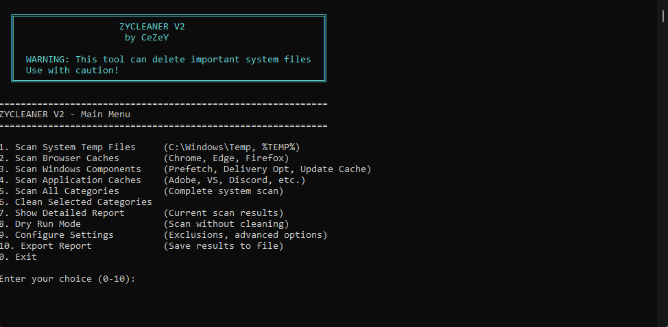

# ZYCLEANER V2 (CLI)
A lightweight command-line utility for cleaning temporary files and system caches on Windows. Built with .NET, it helps free up disk space by removing unnecessary temp files, browser caches safely.

## ⚙️ Features
- Clean system temp files, browser caches, and application data
- Safe deletion with confirmation prompts
- Detailed size reporting before cleaning
- Simple number-based menu interface

### Usage
- Run as administrator and select to scan a directory, then clean the category (or clean them all if you want)

